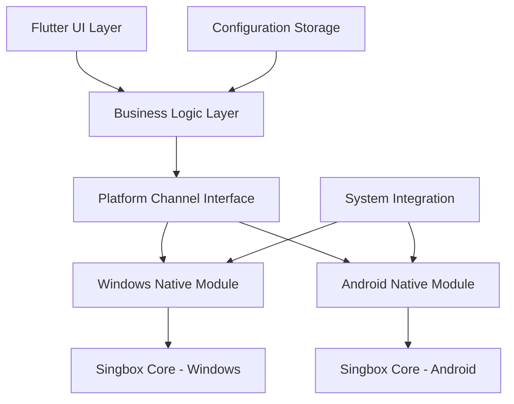

# Design Document

## Overview

The singbox VPN client will be built as a Flutter application targeting Windows and Android platforms. The application will integrate with the singbox core library through platform-specific native implementations, providing a unified Flutter UI while leveraging native VPN capabilities on each platform.

The architecture follows a layered approach with Flutter handling the UI and business logic, while platform-specific native code manages the singbox integration and system-level VPN operations.

## Architecture

### High-Level Architecture



### Component Layers

1. **Flutter UI Layer**: Cross-platform user interface built with Flutter widgets
2. **Business Logic Layer**: Dart-based application logic, state management, and data processing
3. **Platform Channel Interface**: Communication bridge between Flutter and native code
4. **Native Platform Modules**: Platform-specific implementations for Windows and Android
5. **Singbox Integration**: Native integration with singbox core libraries
6. **System Integration**: Platform-specific system services (VPN, networking, notifications)

## Components and Interfaces

### Flutter Components

#### VPN Service Manager
- **Purpose**: Central service for managing VPN operations
- **Responsibilities**:
  - Coordinate VPN connection lifecycle
  - Manage connection state and status updates
  - Handle configuration validation and storage
  - Provide unified interface for UI components

#### Configuration Manager
- **Purpose**: Handle VPN server configurations and user preferences
- **Responsibilities**:
  - Parse and validate configuration files
  - Secure storage of sensitive configuration data
  - Import/export configuration functionality
  - Configuration template management

#### Connection Monitor
- **Purpose**: Monitor and report VPN connection status and performance
- **Responsibilities**:
  - Real-time connection status tracking
  - Network statistics collection and reporting
  - Connection health monitoring
  - Automatic reconnection logic

#### UI Components
- **Main Dashboard**: Connection status, quick connect/disconnect
- **Server List**: Available server configurations with connection options
- **Configuration Screen**: Add/edit server configurations
- **Settings Screen**: Application preferences and advanced options
- **Statistics Screen**: Connection history and performance metrics

### Platform Channel Interfaces

#### VPN Control Interface
```dart
abstract class VpnControlInterface {
  Future<bool> connect(VpnConfiguration config);
  Future<bool> disconnect();
  Future<VpnStatus> getStatus();
  Stream<VpnStatus> statusStream();
  Future<NetworkStats> getNetworkStats();
}
```

#### Configuration Interface
```dart
abstract class ConfigurationInterface {
  Future<bool> validateConfiguration(VpnConfiguration config);
  Future<void> saveConfiguration(VpnConfiguration config);
  Future<List<VpnConfiguration>> loadConfigurations();
  Future<bool> deleteConfiguration(String id);
}
```

### Native Platform Components

#### Windows Native Module
- **Technology**: C++/WinRT with Windows VPN Platform APIs
- **Responsibilities**:
  - Integrate with singbox Windows library
  - Manage Windows VPN adapter creation and configuration
  - Handle Windows-specific networking and routing
  - Implement system tray integration
  - Manage Windows service for background operation

#### Android Native Module
- **Technology**: Kotlin with Android VPN Service APIs
- **Responsibilities**:
  - Integrate with singbox Android library
  - Implement Android VpnService for tunnel management
  - Handle Android-specific networking and routing
  - Manage foreground service for persistent connection
  - Implement Android notification system integration

## Data Models

### VPN Configuration Model
```dart
class VpnConfiguration {
  final String id;
  final String name;
  final String serverAddress;
  final int serverPort;
  final VpnProtocol protocol;
  final AuthenticationMethod authMethod;
  final Map<String, dynamic> protocolSpecificConfig;
  final bool autoConnect;
  final DateTime createdAt;
  final DateTime lastUsed;
}
```

### VPN Status Model
```dart
class VpnStatus {
  final VpnConnectionState state;
  final String? connectedServer;
  final DateTime? connectionStartTime;
  final String? localIpAddress;
  final String? publicIpAddress;
  final NetworkStats? currentStats;
  final String? lastError;
}
```

### Network Statistics Model
```dart
class NetworkStats {
  final int bytesReceived;
  final int bytesSent;
  final Duration connectionDuration;
  final double downloadSpeed;
  final double uploadSpeed;
  final int packetsReceived;
  final int packetsSent;
}
```

## Error Handling

### Error Categories
1. **Configuration Errors**: Invalid server settings, authentication failures
2. **Network Errors**: Connection timeouts, DNS resolution failures
3. **System Errors**: Permission issues, platform-specific failures
4. **Singbox Errors**: Core library errors, protocol-specific issues

### Error Handling Strategy
- **Graceful Degradation**: Application continues to function with limited features when non-critical errors occur
- **User-Friendly Messages**: Technical errors are translated to user-understandable messages
- **Automatic Recovery**: Implement retry mechanisms for transient failures
- **Detailed Logging**: Comprehensive logging for debugging while protecting sensitive information

### Error Recovery Mechanisms
- **Connection Retry**: Automatic reconnection attempts with exponential backoff
- **Configuration Validation**: Pre-connection validation to prevent common errors
- **Fallback Servers**: Automatic failover to alternative servers when available
- **Network Change Handling**: Graceful handling of network transitions

## Testing Strategy

### Unit Testing
- **Flutter Components**: Test business logic, state management, and data processing
- **Configuration Management**: Validate configuration parsing, validation, and storage
- **Error Handling**: Test error scenarios and recovery mechanisms
- **Data Models**: Verify model serialization, validation, and transformation

### Integration Testing
- **Platform Channel Communication**: Test Flutter-to-native communication
- **VPN Connection Flow**: End-to-end connection establishment and termination
- **Configuration Import/Export**: Test configuration file handling
- **Network Statistics**: Verify statistics collection and reporting accuracy

### Platform-Specific Testing
- **Windows Testing**: Test Windows VPN adapter integration and system tray functionality
- **Android Testing**: Test Android VpnService implementation and notification handling
- **Cross-Platform Consistency**: Ensure consistent behavior across platforms

### Performance Testing
- **Connection Speed**: Measure VPN connection establishment time
- **Throughput Testing**: Verify network performance with VPN active
- **Resource Usage**: Monitor CPU, memory, and battery usage
- **Stability Testing**: Long-running connection stability tests

### Security Testing
- **Configuration Security**: Verify secure storage of sensitive configuration data
- **Traffic Isolation**: Ensure proper traffic routing through VPN tunnel
- **DNS Leak Prevention**: Test for DNS leaks and proper DNS routing
- **Kill Switch Functionality**: Verify network blocking when VPN disconnects unexpectedly

## Platform-Specific Considerations

### Windows Implementation
- **Privileges**: Application may require administrator privileges for VPN adapter management
- **System Integration**: Integration with Windows notification system and system tray
- **Service Architecture**: Background Windows service for persistent VPN functionality
- **Firewall Integration**: Proper Windows Firewall rule management

### Android Implementation
- **VPN Permission**: Request and handle VPN permission from user
- **Background Execution**: Implement foreground service for persistent VPN connection
- **Battery Optimization**: Handle Android battery optimization and doze mode
- **Network Security Config**: Proper network security configuration for VPN traffic

## Security Architecture

### Data Protection
- **Configuration Encryption**: Encrypt stored VPN configurations using platform keystore
- **Memory Protection**: Minimize sensitive data exposure in memory
- **Secure Communication**: Use secure channels for configuration synchronization
- **Key Management**: Proper handling and storage of authentication keys and certificates

### Network Security
- **Traffic Isolation**: Ensure all traffic routes through VPN tunnel when connected
- **DNS Protection**: Prevent DNS leaks by routing DNS queries through VPN
- **Kill Switch**: Block network traffic if VPN connection drops unexpectedly
- **IPv6 Handling**: Proper IPv6 traffic handling to prevent leaks